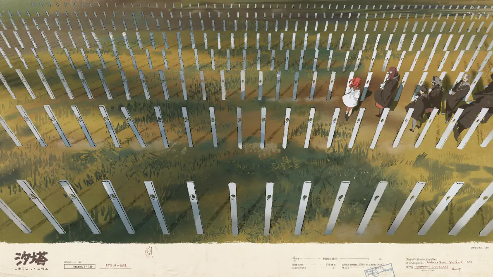

---

title: 城邦
pubDate: 2026-01-13
categories: ['wiki']
description: '本世界居民赖以生存的狭小土地，由大小不同的村镇和规模最大的首都组成，分布在大大小小多个露出云海的高地...'
tags: ['wiki', '地理', 'important']
---

本世界居民赖以生存的狭小土地，由大小不同的村镇和规模最大的首都组成，分布在大大小小多个露出云海的高地上。城邦的政治制度应该是选举制，当前的大执政官是白门。城邦的气候温暖且非常潮湿，但潮湿并不代表“水汽”充沛，这里反而几乎不会“降雨”，而在街角巷尾处的“水坑”大多都是些掺杂有云海的毒性物质的不明液体。另外，受潮汐活动影响，许多地区还需要定期涂刷防蚀漆来保护房屋。城邦的生存高度依赖“捕鲸”，甚至可以说离开了“鲸鱼”城邦就无法存活。

