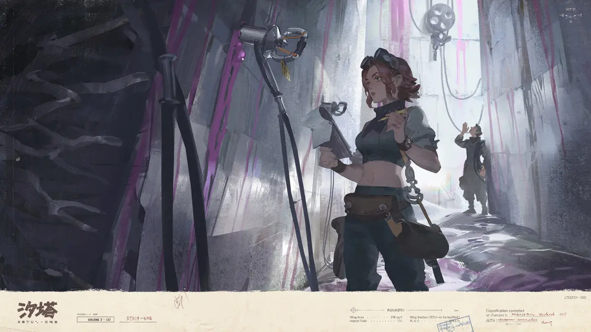
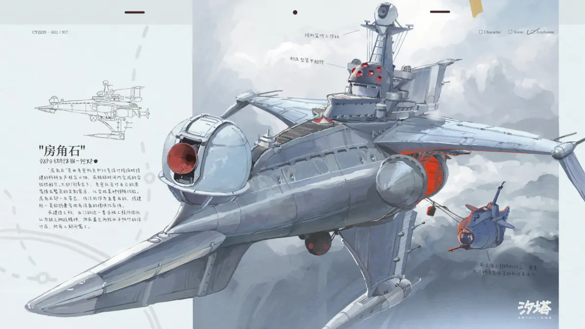
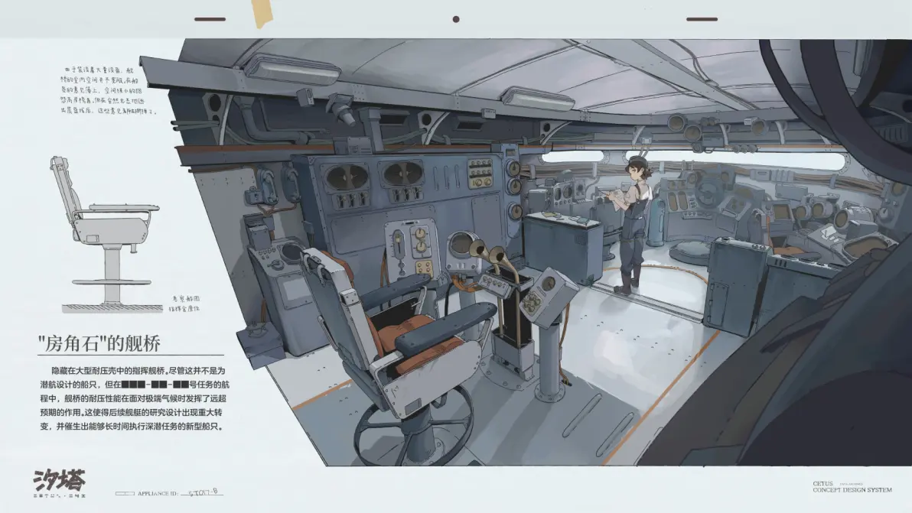

---

title: 科考船
pubDate: 2026-01-13
categories: ['wiki']
description: '为探明世界真相以及发掘云海中暗藏的秘密，城邦组建了考察机关，并派出科考船以及考察队。目前资料中只出现...'
tags: ['wiki', '交通', '载具', '组织']
---

为探明世界真相以及发掘云海中暗藏的秘密，城邦组建了考察机关，并派出科考船以及考察队。目前资料中只出现了一艘科考船——“房角石号”。“房角石”是由考察机关和 33 号设计院临时搭建的科研生产联合小组完成的实验性船只。船长白门是科考界的传奇，同样是当前城邦的首席执政官。

