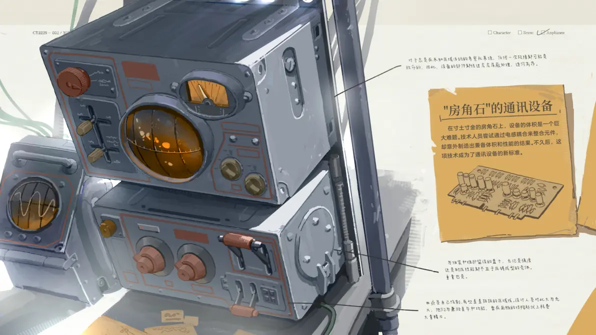
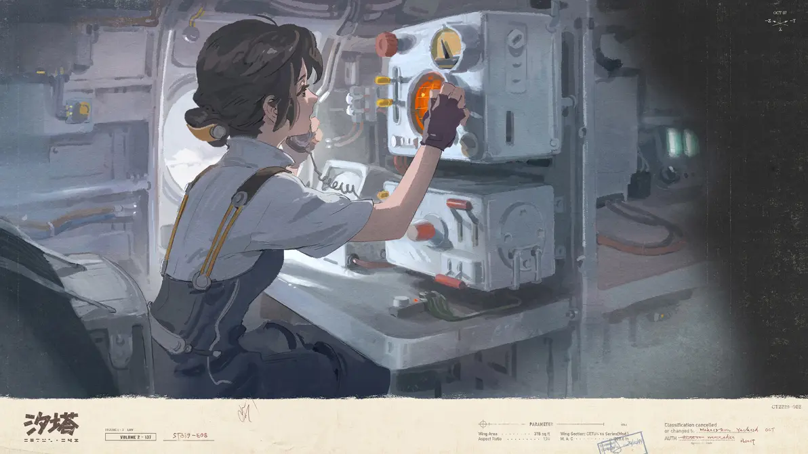

---

title: 考察队
pubDate: 2026-01-13
categories: ['wiki']
description: '考察队的行动班组通常由九人组成。统筹发令的指挥员、负责通讯和现场信息管理的技术人员、医护支援人员以及...'
tags: ['wiki', '组织', '职业']
---

考察队的行动班组通常由九人组成。统筹发令的指挥员、负责通讯和现场信息管理的技术人员、医护支援人员以及由引导员和勘测员组成的三只双人小组。因为时刻处于会被云海吞噬的恐怖中，他们不得不把自己训练成一头动物，用脊椎而不是用大脑思考。

