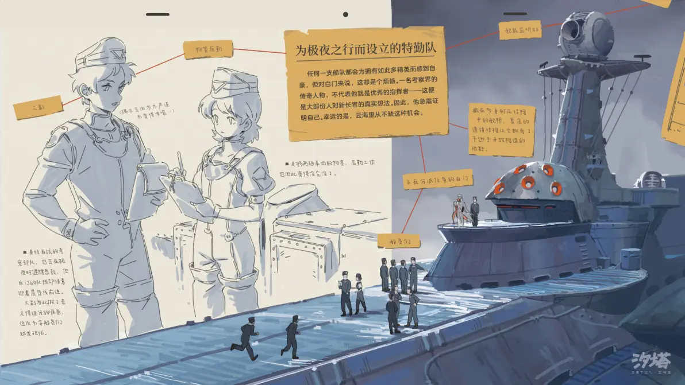

---

title: 记录仪
pubDate: 2026-01-13
categories: ['wiki']
description: '一个可以挂在身旁的盒子一样的物体，是进入云海范围必须随身携带的制式装备，由城邦统一配发，用于记录携带...'
tags: ['wiki', '装备', '工具']
---

一个可以挂在身旁的盒子一样的物体，是进入云海范围必须随身携带的制式装备，由城邦统一配发，用于记录携带者在云海中的活动信息。通过分析记录仪内的声音、温度、气压等数据，再与已有海区的特征图进行比对，就能大致推算出携带者大致的活动范围。

