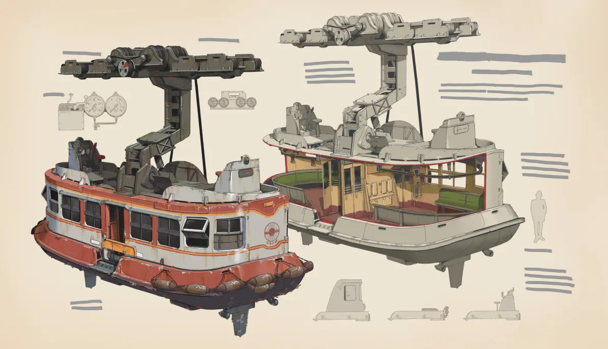
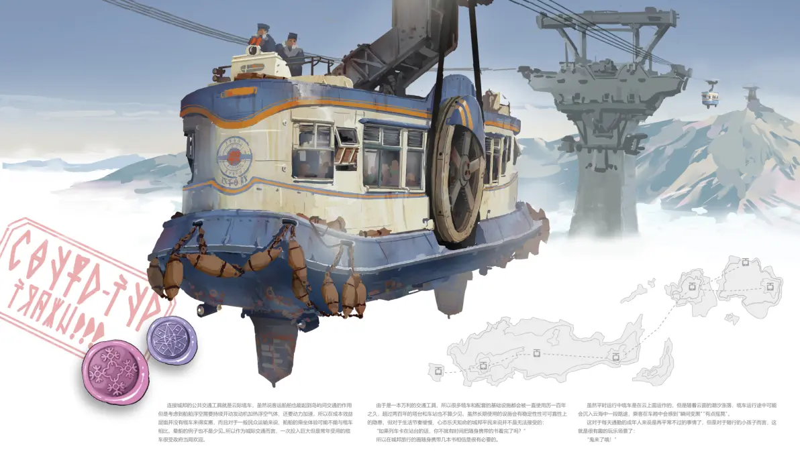
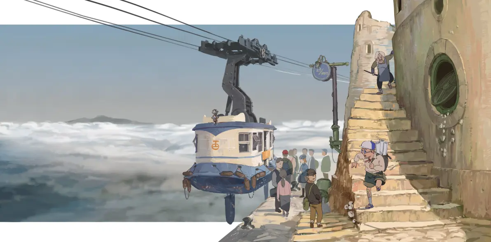

---

title: 飞船
pubDate: 2026-01-13
categories: ['wiki']
description: '受本世界中存在的“云海”影响，人们往往无法通过陆路联系被分割的其他地区的人类，因此发明了能在云海上航...'
tags: ['wiki', '交通', '载具']
---

受本世界中存在的“云海”影响，人们往往无法通过陆路联系被分割的其他地区的人类，因此发明了能在云海上航行的“飞船”。船舶根据不同用途有不同的设备搭配，譬如科考船的下潜装置与捕鲸船的观测站、猎矛等。目前资料不足以判断飞船主体由何种材料制成，但想必是一种低密度、高强度的物质。

